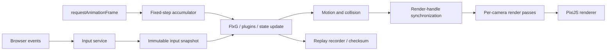

# Flixel AS3 to TypeScript/PixiJS v8 port plan

## 1. Objective

Port the original `org/flixel` engine from AdamAtomic/flixel master to a browser-native TypeScript library, using PixiJS v8 as the rendering and asset foundation while preserving Flixel's recognizable programming model and gameplay behavior.

The reference baseline is upstream commit `8989e5044be072c4abbbaa1317c9854786f6447f` (2011-08-22). The source contains 43 ActionScript classes and 14,928 lines under `org/flixel`, plus embedded fonts, images, and audio.

The goal is source-level familiarity, not mechanical AS3-to-JavaScript transpilation. Existing Flixel games should be portable by changing asset declarations, asynchronous startup, browser-specific integration, and a limited set of APIs documented in a migration guide.

## 2. Definition of done

The port is ready for a 1.0 release when all of the following are true:

- The public compatibility matrix accounts for every upstream class and public method as implemented, adapted, deprecated, deferred, or intentionally unsupported.
- The core lifecycle is stable: `FlxGame`, `FlxG`, `FlxState`, `FlxBasic`, `FlxGroup`, `FlxObject`, and `FlxSprite` work together in a fixed-timestep browser loop.
- Movement, collision separation, group collision, tile collision, path following, and replay are deterministic under a seeded random source.
- Sprites, animations, text, cameras, split-screen, tilemaps, buttons, particles, sound, save data, timers, and plugins work in supported browsers.
- At least three representative games/scenes run: a basic platformer, a particle-heavy action scene, and a multi-camera/tilemap scene.
- CI passes unit, contract, browser integration, visual regression, memory, and benchmark gates.
- The npm package has ESM builds, TypeScript declarations, source maps, API documentation, examples, a migration guide, and the original MIT notice.

## 3. Scope and compatibility policy

### 3.1 Target platform

- TypeScript in strict mode.
- ESM-first npm package.
- PixiJS v8 as a peer dependency.
- Modern evergreen Chrome, Firefox, Safari, and Edge.
- WebGL as the compatibility baseline; WebGPU is allowed where PixiJS can use it without changing engine behavior.
- Vite for examples and development; the engine itself must remain bundler-neutral.
- Node 20+ for development tools and CI, not as a runtime requirement for games.

### 3.2 Compatibility levels

Every upstream API receives one label in `docs/compatibility.md`:

| Level       | Meaning                                                                                          |
| ----------- | ------------------------------------------------------------------------------------------------ |
| Exact       | Same public name and gameplay behavior, subject only to JavaScript typing.                       |
| Adapted     | Same intent, with a browser/Pixi-native signature or async behavior.                             |
| Emulated    | Behavior is reproduced, but the implementation may be more expensive than native Pixi rendering. |
| Deprecated  | Available through a compatibility layer with a recommended modern replacement.                   |
| Unsupported | Cannot be meaningfully reproduced; the migration guide explains the replacement.                 |

### 3.3 Known adaptations

- AS3 `[Embed]` classes become asset aliases, URLs, Pixi `Texture` objects, or typed asset descriptors. Startup and asset loading are asynchronous.
- Flash `BitmapData` is not part of the public core. Pixel APIs such as `pixels`, `stamp`, `replaceColor`, `drawLine`, and bitmap-to-CSV use an optional compatibility surface backed by Canvas or render textures.
- Flash `Stage`, `MovieClip`, `Sound`, `SharedObject`, and browser navigation APIs are hidden behind platform services.
- Audio playback must respect browser gesture-unlock and autoplay restrictions.
- The debugger is functionally equivalent but implemented as a DOM overlay rather than a recreation of Flash display-list windows.
- `FlxG` remains available for source familiarity, but delegates to an explicit engine context for testability. Version 1 supports one active `FlxGame` per JavaScript realm.
- Flixel coordinates, collisions, and angles remain independent of Pixi transforms. Public Flixel angles stay in degrees; the renderer converts to radians.

### 3.4 Initial non-goals

- Running unmodified AS3 source.
- Binary or byte-for-byte compatibility with Flash assets, `BitmapData`, or SWF internals.
- Exact Flash font rasterization and audio timing.
- Supporting Internet Explorer or legacy Canvas-only browsers.
- Recreating undocumented Flash runtime quirks unless an actual Flixel game depends on them.

## 4. Architecture

### 4.1 Core decision: gameplay objects use composition, not Pixi inheritance

`FlxBasic` and its subclasses remain plain TypeScript gameplay objects. Renderable objects own internal Pixi handles through a renderer adapter. They do not extend `PIXI.Container` or `PIXI.Sprite`.

Reasons:

- `FlxGroup`, `FlxSound`, timers, and plugins share `FlxBasic` lifecycle behavior but are not display nodes.
- Flixel collision bounds, origin, offset, facing, scroll factor, and camera membership do not map one-to-one to Pixi transforms.
- A Pixi leaf such as `Sprite`, `Text`, or `Graphics` should not own children in v8.
- Multiple Flixel cameras may render one gameplay object through different passes; a Pixi node can have only one scene-graph parent.
- Domain-only objects remain easy to unit test without a GPU or DOM.

Proposed package boundaries:

```text
packages/flixel/
  src/core/          FlxGame, FlxG, context, state, lifecycle, loop
  src/math/          FlxPoint, FlxRect, FlxU, deterministic RNG
  src/objects/       FlxBasic, FlxObject, FlxGroup, FlxSprite, FlxText
  src/collision/     separation, overlap traversal, quadtree
  src/rendering/     Pixi application adapter, render handles, cameras, effects
  src/assets/        descriptors, aliases, bundles, compatibility loaders
  src/tilemap/       map data, collision tiles, autotiling, chunk renderer
  src/input/         keyboard, pointer/mouse, input snapshots
  src/audio/         FlxSound and browser audio service
  src/storage/       FlxSave adapters
  src/replay/        frame records, serialization, checksums
  src/plugins/       timers and debug path display
  src/debug/         debug events and production-safe hooks
packages/debugger/   optional DOM debugger UI
packages/compat/     expensive/deprecated BitmapData-style helpers
examples/            milestone scenes and ported sample games
tests/               unit, contracts, browser, visual, performance
```

### 4.2 Frame flow



Use a private Pixi ticker or `requestAnimationFrame` only as a clock. Gameplay advances through a fixed-size accumulator, capped to prevent a spiral of death. Rendering happens once after zero or more simulation steps. This keeps Flixel's game framerate separate from browser display cadence and makes replay testing possible.

### 4.3 Camera strategy

Camera behavior is the highest-risk rendering area and must be validated before the broad port.

The proposed design is:

- Keep one logical Flixel world and one render registry.
- Give each `FlxCamera` a viewport container, mask, output surface, transform, and FX overlay.
- Render the world once per active camera using camera-specific transforms and visibility/camera filters.
- Composite each camera output onto a screen-stage container at its screen `x`, `y`, scale, rotation, color, and alpha.
- Keep HUD objects with `scrollFactor = 0` in the same compatibility flow rather than creating a separate public scene API.
- Use render textures only where needed for clipping, camera effects, rotation, or multi-camera isolation; allow a direct-to-screen fast path for one simple camera after correctness is established.

Checkpoint 1 must compare render-to-texture and direct viewport approaches for correctness, batching, memory, and WebGL/WebGPU parity before locking the implementation.

### 4.4 Asset strategy

- `FlxAssets` wraps Pixi `Assets` and owns aliases, manifests, bundles, retry policy, and unload rules.
- Engine constructors do not start network requests. Games preload an asset bundle before constructing states, or explicitly await factory methods.
- `loadGraphic` accepts an alias, URL, `Texture`, spritesheet frame set, or typed descriptor.
- Compatibility overloads may accept constructor-like tokens, but documentation should favor explicit descriptors.
- Per-state bundles are background-loadable and unloadable. Shared engine assets live in a core bundle.
- Pixel-art defaults use nearest-neighbor scaling; per-asset options can opt into linear filtering.

### 4.5 Collision strategy

Do not use Pixi bounds or pointer hit testing for gameplay collision. Port Flixel's CPU-side AABB semantics, swept hulls, collision flags, quadtree traversal, and X/Y separation. Rendering may interpolate, but collision reads only authoritative simulation coordinates.

## 5. Upstream class inventory and destination

| Area             | Upstream classes                                                                   | Destination / treatment                                                                             |
| ---------------- | ---------------------------------------------------------------------------------- | --------------------------------------------------------------------------------------------------- |
| Runtime          | `FlxGame`, `FlxG`, `FlxState`, `FlxBasic`                                          | Core engine context, fixed loop, state lifecycle, global facade.                                    |
| Collections      | `FlxGroup`, `FlxList`                                                              | Typed groups, pooling/recycling, collision traversal; linked-list helper stays internal.            |
| Math and motion  | `FlxPoint`, `FlxRect`, `FlxU`, `FlxPath`, `FlxObject`                              | Engine math types, seeded RNG, integration, path following, overlap and separation.                 |
| Rendering        | `FlxSprite`, `FlxText`, `FlxCamera`, `FlxAnim`, `FlxTileblock`, `FlxTilemapBuffer` | Pixi render handles, text adapters, camera passes, animation state, chunk buffers.                  |
| Tilemaps         | `FlxTilemap`, `FlxTile`                                                            | Data/collision model plus chunked Pixi renderer, autotiling, A*, ray tests.                         |
| Input/UI         | `Input`, `Keyboard`, `Mouse`, `FlxButton`                                          | DOM keyboard and pointer events, frame-state transitions, camera coordinate conversion.             |
| Particles/timing | `FlxParticle`, `FlxEmitter`, `FlxTimer`, `TimerManager`, `DebugPathDisplay`        | Pooled objects, deterministic timers, plugin interfaces, optional Pixi particle optimization later. |
| Audio/storage    | `FlxSound`, `FlxSave`                                                              | Web Audio/HTML audio service and versioned local storage adapter.                                   |
| Replay           | `FlxReplay`, `FrameRecord`, `MouseRecord`                                          | Versioned input snapshots, seeded RNG state, serializer, deterministic playback.                    |
| Debugger         | `FlxDebugger`, `FlxWindow`, `Log`, `Perf`, `Watch`, `WatchEntry`, `VCR`, `Vis`     | Optional DOM debugger package driven by debug hooks; no production dependency.                      |
| Startup/data     | `FlxPreloader` and embedded `data/*`                                               | HTML loading screen and engine asset bundle; preserve attribution and MIT notice.                   |

## 6. Phased implementation and checkpoints

Estimates are engineer-weeks for one experienced TypeScript/game-engine developer and include tests and documentation. They are planning ranges, not delivery promises.

### Phase 0 — Baseline, specification, and repository scaffold (1–2 weeks)

Work:

- Create a monorepo or single-package workspace with TypeScript strict mode, linting, formatting, Vitest, Playwright, API extraction, and Vite examples.
- Pin the upstream baseline commit and copy its MIT license/notice into `THIRD_PARTY_NOTICES.md`.
- Generate `docs/compatibility.md` from the 43-class inventory; list every public property and method.
- Write ADRs for composition, fixed timestep, camera passes, singleton context, assets, and compatibility modules.
- Define supported browser versions and CI lanes.
- Establish code coverage, bundle-size, and benchmark reporting without setting unrealistic final thresholds yet.
- Build a tiny browser harness that initializes Pixi asynchronously and destroys it cleanly.

Checkpoint C0 — project foundation:

- Fresh clone installs and builds with one documented command.
- Unit tests and an empty Playwright smoke test run in CI.
- A canvas starts, renders a test sprite, handles resize/high-DPI, and tears down without leaked listeners.
- The compatibility ledger accounts for 100% of upstream classes and public members.
- No Flixel implementation work starts until the architectural ADRs are reviewed.

### Phase 1 — Risk spikes: loop, cameras, and pixel APIs (2–3 weeks)

Status: completed on 2026-08-06; checkpoint C1 passed. See
[`docs/phase1-evidence.md`](docs/phase1-evidence.md).

Work:

- Prototype a fixed-step accumulator with interpolation and visibility pause/resume.
- Prototype the same world rendered by two cameras with different positions, zooms, rotations, viewports, and object camera filters.
- Exercise follow, world bounds, `scrollFactor`, flash, fade, shake, color tint, alpha, and background fill.
- Compare direct viewport rendering with render-texture composition.
- Prototype `makeGraphic`, animation frame selection, `stamp`, `replaceColor`, per-pixel overlap, and canvas readback cost.
- Record draw calls, CPU time, GPU memory, and behavior on WebGL and WebGPU where available.

Checkpoint C1 — architecture lock:

- One deterministic simulation produces the same final coordinates at 30, 60, and 120 Hz display cadence.
- A single object can appear correctly in two cameras without becoming part of two Pixi parents.
- Camera masking and FX do not leak into neighboring viewports.
- Pixel compatibility APIs have measured costs and are assigned to core, compat, or unsupported status.
- ADRs select the camera pipeline and render-handle ownership model. A failed spike changes the design here, not after the engine is built.

### Phase 2 — Core lifecycle, math, groups, and state management (2–3 weeks)

Status: completed on 2026-08-06; checkpoint C2 passed. See
[`docs/phase2-evidence.md`](docs/phase2-evidence.md).

Classes: `FlxPoint`, `FlxRect`, `FlxU`, `FlxBasic`, `FlxGroup`, `FlxState`, minimal `FlxG`, minimal `FlxGame`.

Work:

- Port value types, color/time helpers, deterministic RNG, and velocity helpers.
- Implement `exists`, `active`, `visible`, `alive`, `kill`, `revive`, and destroy semantics.
- Preserve `preUpdate -> update -> postUpdate` ordering.
- Implement group add/remove/replace, recycling, max size, sorting, traversal, recursive setters/calls, counts, and cleanup.
- Implement atomic state switching at a safe frame boundary.
- Add engine context services under the `FlxG` facade.

Checkpoint C2 — headless core:

- Lifecycle order is verified by contract tests, including additions/removals during update.
- Group recycling and bounded pools pass long-running tests without growth.
- State switching destroys the old state exactly once and never updates a half-created state.
- Seeded RNG produces committed test vectors.
- Core tests run without a DOM, canvas, or Pixi renderer.

### Phase 3 — Motion, paths, overlap, quadtree, and separation (3–4 weeks)

Status: completed on 2026-08-06; checkpoint C3 passed. See
[`docs/phase3-evidence.md`](docs/phase3-evidence.md).

Classes: `FlxObject`, `FlxPath`, `FlxQuadTree`, `FlxList`.

Work:

- Port velocity, acceleration, drag, max velocity, angular motion, last position, hulls, mass, elasticity, immovable, collision flags, touching/just-touched, health, flicker, and reset.
- Port path modes, auto-rotation, node advance, and completion behavior.
- Port object/group expansion into quadtree lists and notification/process callbacks.
- Port X/Y separation in the same order and with the same platform-riding behavior.
- Define floating-point tolerance rules and avoid reading Pixi transforms during simulation.

Checkpoint C3 — collision oracle:

- Golden numeric tests cover stationary overlap, swept collision, moving platforms, immovable pairs, elasticity, high velocity, corner contact, nested groups, self-overlap, and collision masks.
- Collision outcomes are identical across display refresh rates and independent of render interpolation.
- A stress scene with thousands of AABBs meets an agreed CPU budget on reference desktop and mobile hardware.
- No per-frame allocations appear in the principal separation loop after warm-up.

### Phase 4 — Assets, sprites, animation, and text (3–4 weeks)

Status: completed on 2026-08-06; checkpoint C4 passed. See
[`docs/phase4-evidence.md`](docs/phase4-evidence.md).

Classes: `FlxAnim`, `FlxSprite`, `FlxText`, `FlxTileblock`; initial `FlxAssets`.

Work:

- Implement asset descriptors, aliases, manifests, bundles, retry/error reporting, and unload policy over Pixi `Assets`.
- Create sprite render handles and synchronize position, origin, offset, scale, facing, tint, alpha, angle, visibility, and animation frame after simulation.
- Port `loadGraphic`, frame grids, reversed frames, animations, callbacks, `play`, random frame, frame access, offsets, and on-screen checks.
- Use generated textures for `makeGraphic` and tile blocks.
- Implement text alignment, size, color, font, shadow/border variants, and multiline bounds. Use Pixi `Text` for fidelity first and `BitmapText` for documented high-frequency cases.
- Implement compatibility pixel methods according to the C1 decision.

Checkpoint C4 — sprite compatibility:

- A sprite-sheet test covers forward/reverse animation, pause/restart, callbacks, facing, origin/offset, scaling, tint, alpha, and rotation.
- Assets can load, share cache entries, unload state bundles, and recover from a failed URL without corrupting the cache.
- Pixel-art samples stay sharp at integer zoom; high-DPI behavior is documented.
- Visual snapshots pass within a defined tolerance on supported browser engines.
- Repeated state changes do not increase retained textures or render handles.

### Phase 5 — Production camera renderer and visual effects (2–3 weeks)

Status: completed on 2026-08-06; checkpoint C5 passed. See
[`docs/phase5-evidence.md`](docs/phase5-evidence.md).

Classes: complete `FlxCamera`; camera-facing portions of `FlxG`, `FlxObject`, and `FlxSprite`.

Work:

- Productize the C1 camera pipeline with add/remove/reset camera behavior.
- Port follow styles, dead zones, focus, bounds, world bounds, zoom, scale, angle, alpha, color, background, and viewport placement.
- Port flash, fade, shake, stop FX, and effect callbacks on deterministic timers.
- Implement per-object camera lists, screen/world coordinate conversion, on-screen queries, and debug bounds.
- Add a fast single-camera path only if it passes the same contract suite.

Checkpoint C5 — multi-camera gate:

- Split-screen test renders world objects, camera-specific objects, HUD objects, and effects correctly in two simultaneous cameras.
- Pointer-to-world conversion is correct for translated, zoomed, and rotated cameras.
- Resize and device-pixel-ratio changes preserve logical game coordinates and viewport layout.
- Camera creation/destruction releases render textures and listeners.
- Single- and multi-camera paths pass the same screenshots and coordinate contracts.

### Phase 6 — Tilemaps, autotiling, collision, ray tests, and pathfinding (4–5 weeks)

Status: completed on 2026-08-06; checkpoint C6 passed. See
[`docs/phase6-evidence.md`](docs/phase6-evidence.md).

Classes: `FlxTilemap`, `FlxTile`, `FlxTilemapBuffer`.

Work:

- Port CSV parsing/export, indices, tile queries/updates, instances, coordinates, collision properties, callbacks, and bounds.
- Port OFF/AUTO/ALT autotiling with committed reference fixtures.
- Keep map/collision data independent from rendering.
- Implement a chunked renderer that rebuilds only dirty chunks. Start with batched sprites or generated chunk textures; adopt a custom mesh/batcher only after profiling.
- Port visible-region culling, multi-camera chunk visibility, map following, overlap callbacks, rays, A* pathfinding, simplification, and ray simplification.
- Define behavior for runtime tile mutation and state-bundle asset unloading.

Checkpoint C6 — tilemap gate:

- Known maps produce exact autotile indices for OFF, AUTO, and ALT modes.
- Tile/object separation, one-way/callback tiles, map offsets, and changed tiles pass contract tests.
- A* returns valid paths and the simplifiers never cross solid tiles.
- A large scrolling map maintains the agreed frame budget and rebuilds only dirty chunks.
- Multi-camera rendering does not duplicate map data or rebuild unaffected chunks.

### Phase 7 — Keyboard, pointer/mouse, and buttons (2–3 weeks)

Status: completed on 2026-08-06; checkpoint C7 passed. See
[`docs/phase7-evidence.md`](docs/phase7-evidence.md).

Classes: `Input`, `Keyboard`, `Mouse`, `FlxButton`.

Work:

- Capture DOM events into a queue and publish input state only at simulation-step boundaries.
- Port pressed/just-pressed/just-released transitions, aliases, reset, any-key, record, and playback.
- Implement pointer buttons, wheel, visibility, cursor loading, screen/world positions, and camera selection.
- Use pointer capture/global movement where dragging must survive leaving an object or canvas.
- Port button state visuals, toggle behavior, callbacks, sound hooks, and touch-friendly pointer semantics.
- Prevent stuck input on blur, visibility change, pointer cancellation, and context-menu transitions.

Checkpoint C7 — input gate:

- Every transition is exactly one simulation step, including low display FPS and multiple simulation steps in one frame.
- Keyboard layouts use physical/code mappings where appropriate and document compatibility aliases.
- Mouse/pointer world coordinates pass all C5 camera transforms.
- Blur and pointer cancellation leave no stuck keys or buttons.
- A recorded input sequence replays through the same public input APIs.

### Phase 8 — Particles, timers, and plugins (2–3 weeks)

Classes: `FlxParticle`, `FlxEmitter`, `FlxTimer`, `TimerManager`, `DebugPathDisplay`.

Work:

- Port emitter geometry, launch modes, velocity/rotation ranges, lifespan, quantity, and explosion/stream behavior.
- Use `FlxGroup` recycling as the correctness path; evaluate Pixi `ParticleContainer` only as an opt-in render adapter that does not change lifecycle semantics.
- Port deterministic timers and plugin update/draw registration/removal.
- Implement debug path drawing through a dedicated graphics layer.

Checkpoint C8 — effects gate:

- Seeded emitters produce repeatable spawn order and initial conditions.
- A long particle stress test reaches a stable allocation plateau and returns objects to the pool.
- Timers fire the correct number of times across pause, state switch, catch-up frames, cancel, and reset.
- Removing a plugin during its callback is safe and does not skip unrelated plugins.

### Phase 9 — Audio and save data (2–3 weeks)

Status: completed on 2026-08-06; checkpoint C9 passed. See
[`docs/phase9-evidence.md`](docs/phase9-evidence.md).

Classes: `FlxSound`, `FlxSave`.

Work:

- Define an audio backend interface and implement browser audio with explicit unlock state.
- Port music, effects, streaming URLs, looping, pause/resume/stop, volume, mute, fade, auto-destroy, and proximity pan/attenuation.
- Handle focus pause, suspended audio contexts, missing assets, and mobile Safari restrictions.
- Implement namespaced, versioned save slots with localStorage first; allow an IndexedDB adapter for larger/async data.
- Expose serialization errors and quota failures instead of silently losing data.

Checkpoint C9 — platform services gate:

- Audio begins only after user unlock and resumes correctly after tab suspension.
- Loop, fade, global volume, mute, pause, and auto-destroy pass real-browser tests.
- Save bind/write/read/erase survives reload, schema migration, quota failure simulation, and malformed stored data.
- Audio and storage can be replaced with fakes in headless tests.

### Phase 10 — Replay and deterministic verification (2–3 weeks)

Classes: `FlxReplay`, `FrameRecord`, `MouseRecord`; replay-facing `FlxG` APIs.

Work:

- Version the replay file format and record seed, fixed-step configuration, keyboard transitions, pointer state, and engine version.
- Port record, save, load, playback, rewind, timeout, cancel keys, standard mode, and frame stepping.
- Add periodic deterministic checksums over selected game state to identify the first divergent frame.
- Decide whether old AS3 replay text can be imported; provide a converter if practical and label it separately from the new format.

Checkpoint C10 — replay gate:

- The same replay run repeatedly produces the same final checksum and checkpoint hashes.
- Recordings remain stable at 30, 60, and 120 Hz display cadence.
- A deliberately changed simulation reports the first divergent frame with useful diagnostics.
- Pause, rewind, one-frame step, timeout, and user cancel behavior pass browser tests.

### Phase 11 — Debugger and preloader (3–4 weeks)

Classes: `FlxDebugger`, `FlxWindow`, `Log`, `Perf`, `Watch`, `WatchEntry`, `VCR`, `Vis`, `FlxPreloader`.

Work:

- Build the debugger as an optional DOM package consuming structured engine debug events.
- Implement log, watch/unwatch, FPS/update/render timing, object bounds, camera visibility, collision visualization, and VCR controls.
- Add object selection and compact scene diagnostics where they help replace Flash debugger workflows.
- Build an accessible HTML loading screen with asset progress, retry, and fatal-error states.
- Ensure production tree-shaking removes the debugger UI and expensive hooks when disabled.

Checkpoint C11 — tooling gate:

- Logs, watch values, perf graphs, visual toggles, pause/restart/step, record, and replay work in a sample game.
- The debugger cannot mutate simulation state while replay verification is locked, except through explicit VCR commands.
- Keyboard navigation and screen-reader labels exist for debugger controls and the loading/error UI.
- Production bundle analysis shows no debugger UI dependency and negligible disabled-hook overhead.

### Phase 12 — Whole-game ports, API closure, and migration docs (4–6 weeks)

Work:

- Port three representative samples in increasing complexity: Hello World/basic movement, a platformer with tilemaps/collision, and an action scene with particles, audio, save, replay, and multiple cameras.
- Complete the member-by-member compatibility ledger.
- Add AS3-to-TypeScript recipes for constructors, state switching, embedded assets, callbacks, maps, text, sound, save data, input, replay, and custom drawing.
- Add API docs, lifecycle guide, performance guide, browser restrictions, debugging guide, and extension points.
- Run a source-port exercise on one external open-source Flixel game to discover missing assumptions, subject to its license.

Checkpoint C12 — release candidate feature gate:

- All three samples are playable using only documented public APIs.
- The external port produces a written gap report; every blocker is fixed or explicitly classified.
- The compatibility ledger has no unknown entries.
- No sample imports private engine modules.
- Documentation passes clean-room review by someone who did not implement the feature.

### Phase 13 — Performance, browser hardening, and 1.0 release (3–4 weeks)

Work:

- Profile before optimizing; tune batching, atlases, render groups, culling, tile chunks, text choice, resolution, and object pools based on measured bottlenecks.
- Pre-upload large scenes where first-frame GPU uploads cause hitches.
- Validate texture and render-handle cleanup across repeated state/game teardown.
- Run browser/device matrix, long-session soak tests, memory-pressure tests, resize/fullscreen/focus tests, and accessibility checks.
- Publish release candidates, freeze API, write changelog and upgrade policy, then publish 1.0.

Checkpoint C13 — 1.0 release gate:

- No critical or high-severity correctness bugs remain.
- Reference scenes meet agreed CPU, GPU, memory, and bundle-size budgets on target devices.
- A 30-minute automated soak has no monotonically growing object, listener, texture, audio-node, or render-texture count.
- WebGL passes on every supported browser; WebGPU failures fall back cleanly without gameplay differences.
- Package install, ESM import, type declarations, source maps, examples, license notices, and release provenance are verified from the published tarball.

## 7. Verification strategy

### 7.1 Test layers

| Layer                | What it proves                                                                                            |
| -------------------- | --------------------------------------------------------------------------------------------------------- |
| Unit                 | Math, RNG, lifecycle, groups, motion, collision separation, paths, autotiling, A*, timers, serialization. |
| Contract             | Public Flixel behavior and ordering, derived from upstream source and committed fixtures.                 |
| Headless integration | State transitions, collision worlds, replay checksums, fake audio/storage, cleanup without GPU noise.     |
| Browser integration  | Pixi init/destroy, asset loads, input, cameras, audio unlock, storage, resize, visibility, fullscreen.    |
| Visual regression    | Seeded fixed-frame captures for sprites, text, cameras, FX, tilemaps, debug layers, and loading UI.       |
| Performance          | Update time, render time, draw calls, allocations, texture memory, tile rebuilds, input hit-test cost.    |
| Soak/leak            | Repeated state changes, asset bundle churn, emitters, audio nodes, camera creation, app teardown/re-init. |

### 7.2 Behavior oracle

- Preserve the upstream source and generated ASDoc as the normative API reference.
- For algorithms, create explicit input/output vectors directly from the AS3 implementation before rewriting it.
- Where feasible, run small original SWFs through a Flash-compatible reference environment such as Ruffle to capture timing-independent behavior and screenshots. Do not make release testing depend on that environment.
- Prefer numeric/state comparison over pixels for collision, input, and replay.
- Use tolerant image comparison for rendering because Flash and browser font/GPU rasterization will differ.

### 7.3 Required benchmark scenes

- 10,000 inactive pooled objects and 2,000 active moving sprites.
- Dense object/object collision with nested groups.
- Large scrolling tilemap with runtime edits and two cameras.
- 5,000 pooled particles with multiple blend modes.
- Text-heavy HUD with rapidly changing counters.
- Repeated state transition and asset-unload loop.

Budgets should be recorded at C0, tightened after C4/C6, and frozen for 1.0 at C12. Avoid declaring absolute FPS targets without named hardware, resolution, browser, and scene configuration.

## 8. Risk register

| Risk                                                                    | Impact    | Mitigation / decision point                                                                                                  |
| ----------------------------------------------------------------------- | --------- | ---------------------------------------------------------------------------------------------------------------------------- |
| Multi-camera retained-mode rendering differs from Flixel bitmap buffers | Very high | C1 spike before core implementation; render-pass contracts; no Pixi-parent assumptions in gameplay objects.                  |
| Pixel mutation causes GPU readback stalls                               | High      | Isolate in optional compat package; benchmark at C1; favor generated textures/Canvas staging and document costs.             |
| Variable browser cadence breaks Flixel physics/replay                   | Very high | Fixed-step simulation, input snapshots at step boundaries, seeded RNG, checksums from Phase 2 onward.                        |
| Tilemap rendering becomes CPU/draw-call bound                           | High      | Separate data from rendering, dirty chunks, atlases, culling, profile before custom mesh/batcher.                            |
| Asset loading is async while AS3 embedded assets were synchronous       | High      | Explicit preload bundles, async game startup, typed descriptors, migration recipes, no hidden network loads in constructors. |
| Audio behavior differs by browser                                       | High      | Backend abstraction, gesture unlock, real-device tests, explicit suspended/error states.                                     |
| `FlxG` global state makes tests and multiple games fragile              | Medium    | Internal context/service registry; facade only; one-active-game limitation documented for 1.0.                               |
| Floating-point differences cause collision/replay drift                 | High      | Test vectors, fixed order, tolerance policy, no renderer transforms in simulation, per-frame replay checksums.               |
| Debugger expands scope and couples to internals                         | Medium    | Optional package consuming stable debug events; deliver after core/replay; tree-shaking gate.                                |
| Class-by-class port passes tests but fails real games                   | Very high | Vertical samples at every milestone and a clean-room external game port before release.                                      |

## 9. Delivery sequencing and staffing

The critical path is C0 → C1 → C2 → C3 → C4 → C5 → C6 → C7 → C10 → C12 → C13. Audio/save, particles/plugins, and debugger can overlap after core contracts stabilize.

For one experienced developer, the phase estimates total 35–50 engineer-weeks, including compatibility tests, examples, documentation, and browser hardening. A two- or three-person team can shorten elapsed time, but the camera, fixed-loop, object model, and collision contracts should remain under tightly coordinated ownership. Expect additional time if the target is “minimal changes for arbitrary legacy games” rather than a documented compatibility port.

Suggested workstreams after C3:

- Runtime/physics owner: object model, collision, replay, determinism.
- Rendering owner: Pixi handles, sprites, cameras, tile chunks, performance.
- Platform/tooling owner: assets, input, audio, save, browser CI, debugger, docs/examples.

No phase is considered complete merely because its classes compile. Its checkpoint must pass in CI and in the current vertical sample before dependent work proceeds.

## 10. First implementation backlog after plan approval

1. Scaffold TypeScript/PixiJS workspace and CI.
2. Commit upstream API inventory and license notice.
3. Write ADR-001 composition vs inheritance.
4. Write ADR-002 fixed-step accumulator and input snapshot timing.
5. Implement the C1 two-camera spike before public engine classes.
6. Measure pixel-compatibility prototypes and classify them.
7. Review C1 evidence and lock the rendering contract.
8. Begin the headless C2 core only after the risk-spike gate passes.

## 11. Primary references

- [Original Flixel `org/flixel` source](https://github.com/AdamAtomic/flixel/tree/master/org/flixel)
- [Original Flixel class reference](https://flixel.org/docs/class-summary.html)
- [PixiJS v8 architecture](https://pixijs.com/8.x/guides/concepts/architecture)
- [PixiJS v8 application lifecycle](https://pixijs.download/release/docs/app.Application.html)
- [PixiJS v8 scene objects](https://pixijs.com/8.x/guides/components/scene-objects)
- [PixiJS v8 assets](https://pixijs.com/8.x/guides/components/assets)
- [PixiJS v8 ticker](https://pixijs.com/8.x/guides/components/ticker)
