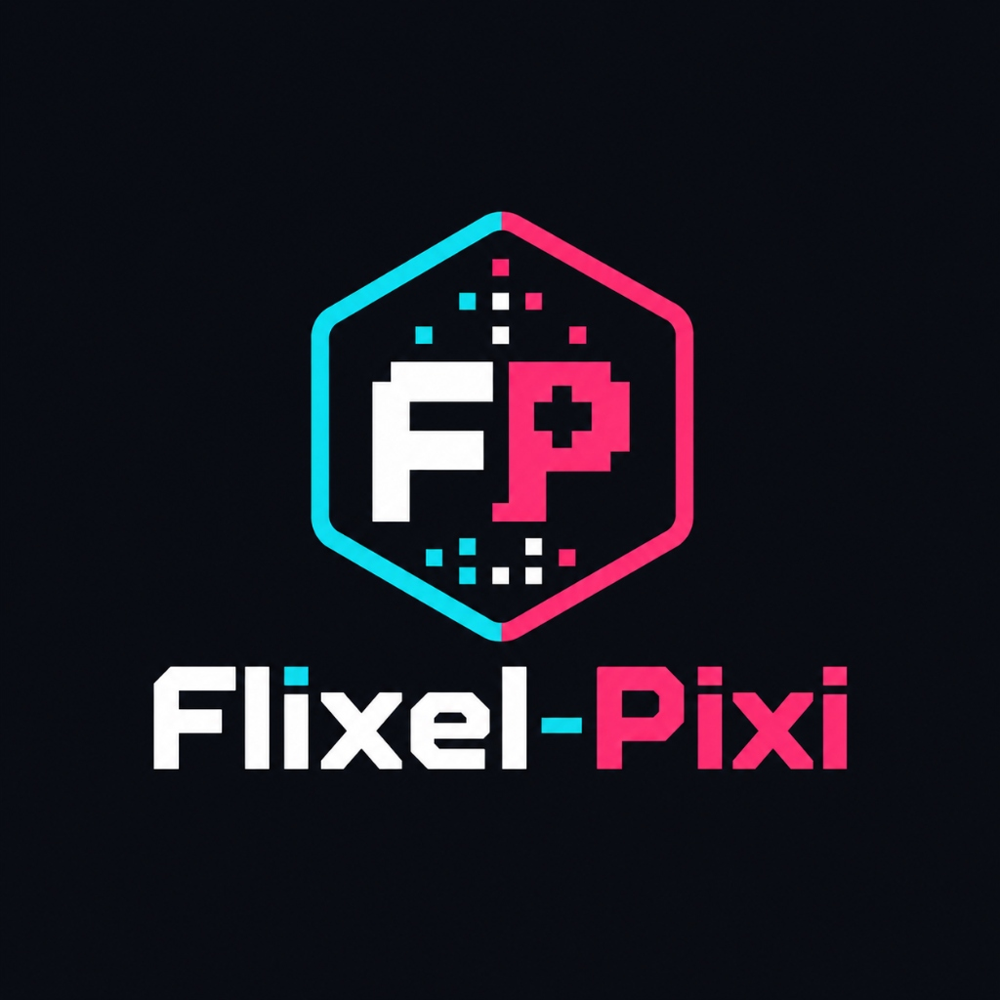

<p align="center">
  
</p>

# flixel-pixi

[](https://www.npmjs.com/package/flixel-pixi)
[](https://www.npmjs.com/package/flixel-pixi)
[](https://github.com/vdokkupalle-ebsco/flixel-pixi/actions/workflows/pr-checks.yml)
[](https://vdokkupalle-ebsco.github.io/flixel-pixi/)
[](https://www.npmjs.com/package/pixi.js)
[](./LICENSE)

`flixel-pixi` is a browser-native TypeScript game engine that ports the original
ActionScript 3 Flixel API onto PixiJS v8. It combines a deterministic fixed-step
game loop with modern rendering, input, audio, assets, accessibility, and
responsive browser integration.

The project is currently on the `0.1.0-rc.*` prerelease line. APIs may change
between release candidates when real-game validation exposes a concrete issue.

## Install

Install the published prerelease and its PixiJS peer from the `next` channel:

```bash
npm install flixel-pixi@next pixi.js@^8.19.0
```

Supported production browsers follow the Vite 8 Baseline Widely Available
target: Chrome 111+, Edge 111+, Firefox 114+, Safari 16.4+, and iOS Safari
16.4+. WebGL is required; WebGPU is optional and falls back to WebGL. Internet
Explorer and legacy embedded WebViews are not supported. The documented
development workflow requires Node.js 22.12 or newer.

## Quick start

Add a host element to the page:

```html
<div id="game"></div>
```

Create a state and boot the browser application:

```ts
import { createBrowserGame, FlxSprite, FlxState } from 'flixel-pixi';

class PlayState extends FlxState {
  override create(): void {
    const player = new FlxSprite(304, 224);
    player.makeGraphic(32, 32, 0x22c55e);
    this.add(player);
  }
}

const host = document.querySelector<HTMLElement>('#game');
if (!host) throw new Error('Missing #game host.');

const application = await createBrowserGame({
  host,
  initialState: PlayState,
  width: 640,
  height: 480,
});

window.addEventListener('pagehide', () => application.destroy(), {
  once: true,
});
```

`createBrowserGame` owns Pixi initialization, fixed simulation updates,
rendering, browser input, loading, viewport scaling, and teardown. In a real
application, retain the returned object and call `destroy()` only when the game
is unmounted.

## Highlights

- Deterministic states, groups, motion, collision, timers, tweens, paths, and
  replay.
- PixiJS sprites, animation, text, tilemaps, cameras, filters, meshes, particles,
  and responsive viewports.
- A hosted Particle Editor for layered effects, generated or uploaded textures,
  versioned JSON exports, and ready-to-integrate bundles.
- Keyboard, pointer, touch, swipe, gamepad, virtual controls, remappable actions,
  and accessible native UI overlays.
- Asset bundles, customizable preloaders, Web Audio, spatial sound, storage,
  debugger tools, performance budgets, and explicit resource teardown.
- Playable examples, including platform, swipe, UI, rendering, and the pinned
  Flx-Invaders compatibility port.

## Documentation

- [Documentation index](docs/README.md)
- [Lifecycle and browser boot](docs/guides/lifecycle.md)
- [Making games](docs/guides/making-games.md)
- [Browser support](docs/browser-support.md)
- [Particle Editor and layered effects](docs/guide/particle-editor.md)
- [Compatibility with the AS3 baseline](docs/compatibility.md)
- [Versioning and API stability](docs/versioning.md)
- [Contributing](CONTRIBUTING.md)
- [Changelog](CHANGELOG.md)

Import public APIs only from `flixel-pixi`; internal `src/**` paths and deep
`dist/**` imports are unsupported.

## License

`flixel-pixi` is MIT licensed. The original Flixel copyright and license are
preserved in [THIRD_PARTY_NOTICES.md](THIRD_PARTY_NOTICES.md).
